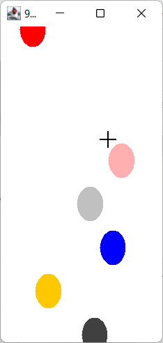
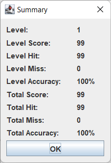

# 99balloons

> »Neunundneunzig Luftballons  
Auf ihrem Weg zum Horizont  
Hielt man für UFOs aus dem All  
Darum schickte ein General  
'Ne Fliegerstaffel hinterher  
Alarm zu geben, wenn's so wär«  
— Nena

## Intro

Although I'm not particularly interested in computer graphics and games, I
want to develop a balloon shooting game. A player shoots balloons that start from
the bottom of the screen. The balloons are flying until they break or reach the
top of the screen. If a balloon hits the top, the game is over. When the player
hits the balloon, the score is incremented. The initial location of the
balloon is random. The level number increases after breaking the 99th balloon. In the
next level, the balloon's speed increases. The player wins when the player reaches
level 99. Solid colour graphics include only the balloons and a crosshair. Sound is
MIDI music, as well as a balloon-popping sound.  

## Screenshots

## Jokes

